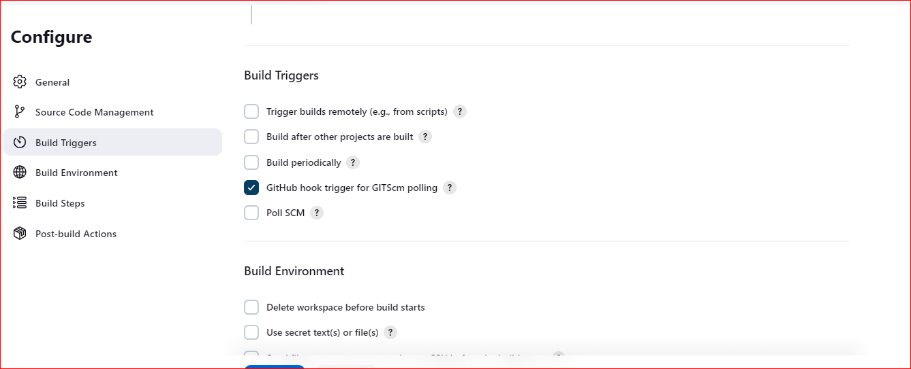
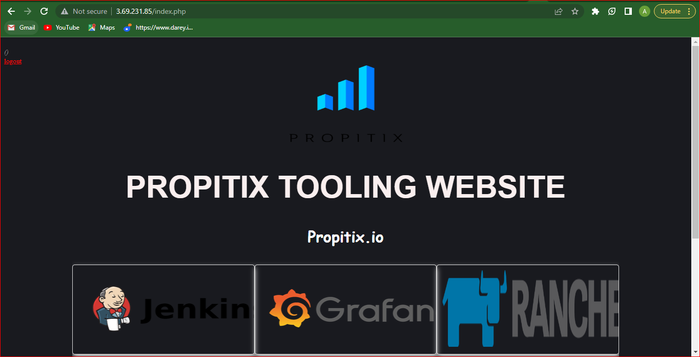

# ANSIBLE REFACTORING AND STATIC ASSIGNMENTS

In this project you i continue working with ansible-config-mgt repository, set-up for project 11, I created a directory to copy all the artifacts in the jenkins ansible job. Then I change the permission of the file to allow anybody to read, write and execute on the directory so that jenkins will also be able to add to the directory

then i Change permissions to this directory, so Jenkins could save files there – chmod -R 0777 /home/ubuntu/ansible-config-artifact
after changing my permissions i went to my jenkins web console  Manage Jenkins -> Manage Plugins -> on Available tab i search for Copy Artifact and install it without restarting,then i create a new freestlye project and name it save_artifacts.

## REFACTOR ANSIBLE CODE BY IMPORTING OTHER PLAYBOOKS INTO SITE.YML

 Within the playbook directory I created new file **site.yml** then move the common.yml to a new directory **static-assignment
 

 Create a new folder in root of the repository and name it static-assignments, then i Move common.yml file into the newly created static-assignments folder.
 

 Inside site.yml file,i import common.yml playbook.

then i Run ansible-playbook command against the dev environment

after that i Make sure that wireshark is deleted on all the servers by running wireshark --version

### Configure UAT Webservers with a role 'Webserver'

i Launch 2 fresh EC2 instances using RHEL 8 image, and name it – Web1-UAT and Web2-UAT.

 create a directory called roles, after that i Update my inventory ansible-config-mgt/inventory/uat.yml file with IP addresses of the 2 UAT Web servers,then i connect using ssh agent.
 

In /etc/ansible/ansible.cfg file uncomment roles_path string and provide a full path to your roles directory roles_path    = /home/ubuntu/ansible-config-mgt/roles, so Ansible could know where to find configured roles.

in **tast** directory  within the main.yml file,i start writing configuration tasks to do the following:

Install and configure Apache (httpd service)
Clone Tooling website from GitHub https://github.com/<your-name>/tooling.git.
Ensure the tooling website code is deployed to /var/www/html on each of 2 UAT Web servers.
Make sure httpd service is started

## Reference ‘Webserver’ role

Within the static-assignments folder,i create a new assignment for uat-webservers uat-webservers.yml. This is where i will reference the role.

i Commit changes, create a Pull Request and merge them to master branch,then i  run the playbook against your uat inventory.

now i will  able to see both of my UAT Web servers configured so i can try to reach them from my browser

Thank you
`